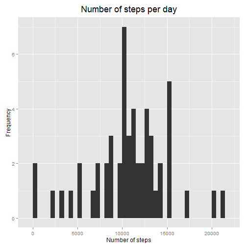
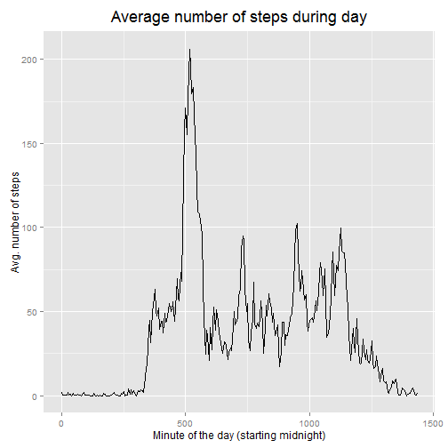
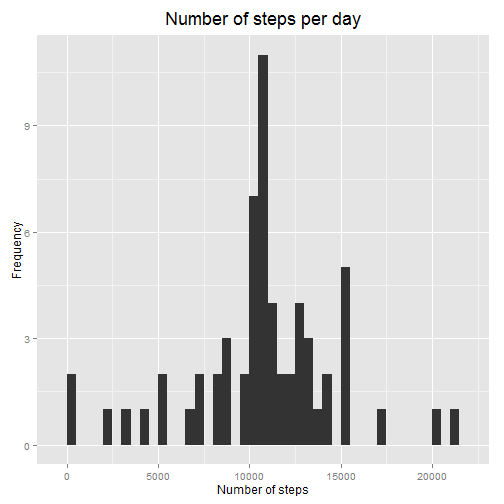
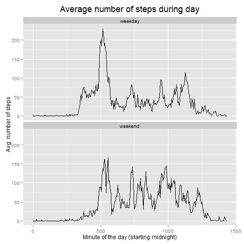

# Reproducible Research: Peer Assessment 1

Packages needed to run the code:


```r
library(dplyr)
library(ggplot2)
```

## Loading and preprocessing the data

In this section, source data are unzipped and read into R. "Interval" variable
is transformed into minutes, "date" variable into date. Package dplyr is used.


```r
unzip("./activity.zip")
actdata <- read.csv("./activity.csv", header = TRUE)

minutes <- rep(seq(0, 24*60-5, by = 5), 61)

actdata <- tbl_df(actdata)
actdata <- actdata %>% mutate(date = as.Date(date, "%Y-%m-%d"))
actdata$time <- minutes
```


## What is mean total number of steps taken per day?

A new dataset suited for the analysis is created using dplyr package.


```r
stat1 <- actdata %>%
     group_by(date) %>%
     summarise(total_steps = sum(steps))
```

Histogram of total number of steps taken per day is done using ggplot2 package.


```r
g1 <- ggplot(data = stat1, aes(x = total_steps))

g1 + geom_bar(binwidth = 500) + ggtitle("Number of steps per day") +
     xlab("Number of steps") + ylab("Frequency") +
     theme(plot.title = element_text(size = rel(1.5), vjust = 1.5))
```

 

Finally, mean and median of the number of steps taken per day is calculated.


```r
mean(stat1$total_steps, na.rm = TRUE)
```

```
## [1] 10766.19
```

```r
median(stat1$total_steps, na.rm = TRUE)
```

```
## [1] 10765
```


## What is the average daily activity pattern?

For the next task, dataset is again prepared by using dplyr package and graph is
plotted using ggplot2 package. We remind that for the x-axis, minutes of a day 
are used


```r
stat2 <- actdata %>%
     group_by(time) %>%
     summarise(avg_steps = mean(steps, na.rm = TRUE))

g2 <- ggplot(data = stat2, aes(x = time, y = avg_steps))

g2 + geom_line() + ggtitle("Average number of steps during day") +
     xlab("Minute of the day (starting midnight)") + ylab("Avg. number of steps") +
     theme(plot.title = element_text(size = rel(1.5), vjust = 1.5))
```

 

Minute of the day where maximum number of steps is recorded in average:


```r
stat2[which.max(stat2$avg_steps), 1]
```

```
## Source: local data frame [1 x 1]
## 
##   time
## 1  515
```


## Imputing missing values

Let's start by checking the number of missing values in individual columns:


```r
colSums(is.na(actdata))
```

```
##    steps     date interval     time 
##     2304        0        0        0
```

According to this, the missing values occur in the column "steps". We will
impute these missing values by using averages for the particular time period. We
will use the dataset with average values generated in the previous step.


```r
impCol <- rep(stat2$avg_steps, 61)
actdataImp <- actdata
actdataImp[is.na(actdataImp$steps), 1] <- impCol[is.na(actdataImp$steps)]
rm(impCol)
```

After imputing the missing values, let's replicate the code from the first task
to see the difference:


```r
stat3 <- actdataImp %>%
     group_by(date) %>%
     summarise(total_steps = sum(steps))

g3 <- ggplot(data = stat3, aes(x = total_steps))

g3 + geom_bar(binwidth = 500) + ggtitle("Number of steps per day") +
     xlab("Number of steps") + ylab("Frequency") +
     theme(plot.title = element_text(size = rel(1.5), vjust = 1.5))
```

 

The histogram has obviously changes, so we will have a look at other statistics:


```r
mean(stat3$total_steps, na.rm = TRUE)
```

```
## [1] 10766.19
```

```r
median(stat3$total_steps, na.rm = TRUE)
```

```
## [1] 10766.19
```

After imputing the missing values, median is equal to mean.

## Are there differences in activity patterns between weekdays and weekends?

In the last section, we compare the steps during the day for weedays vs.
weekends. In the first steps, we create factor variables containing abbreviated
day names and assign "weekday" or "weekend" to them.


```r
actdataImp <- actdataImp %>%
     mutate(weekday = as.factor(weekdays(date, TRUE)),
            daytype = as.factor(ifelse(weekday %in% c("Sat", "Sun"), 
                                       "weekend", "weekday")))
```

Further, we replicate the plots done in one of the previous tasks:


```r
stat4 <- actdataImp %>%
     group_by(daytype, time) %>%
     summarise(avg_steps = mean(steps, na.rm = TRUE))

g4 <- ggplot(data = stat4, aes(x = time, y = avg_steps))

g4 + geom_line() + facet_wrap(~ daytype, ncol = 1) +
     ggtitle("Average number of steps during day") +
     xlab("Minute of the day (starting midnight)") + ylab("Avg. number of steps") +
     theme(plot.title = element_text(size = rel(1.5), vjust = 1.5))
```

 

It can be seen that the pattern is different. During weekdays there is a major
peak in the morning and one more in the evening, for the weekend, the
distribution is more uniform.
